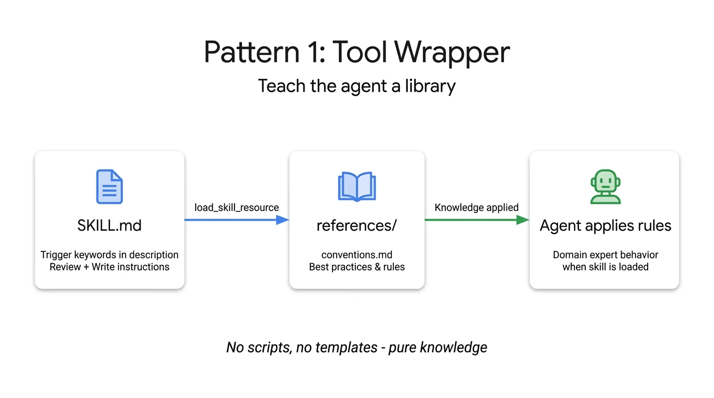
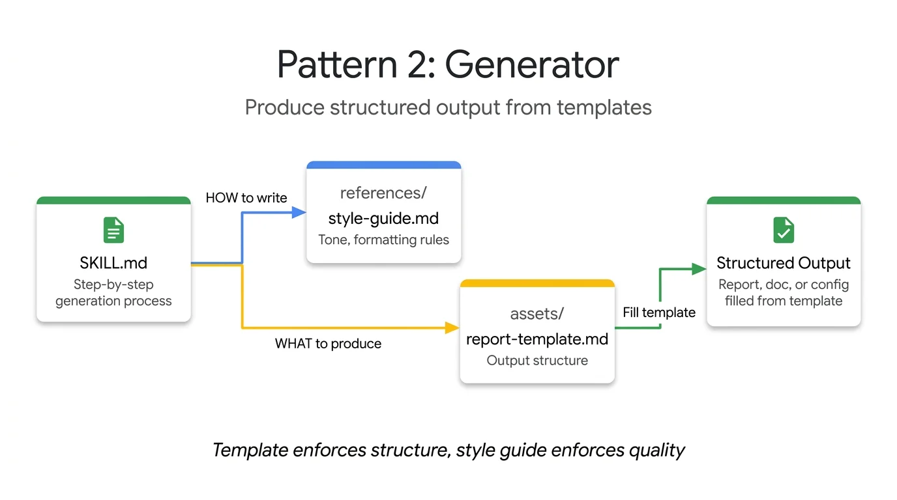
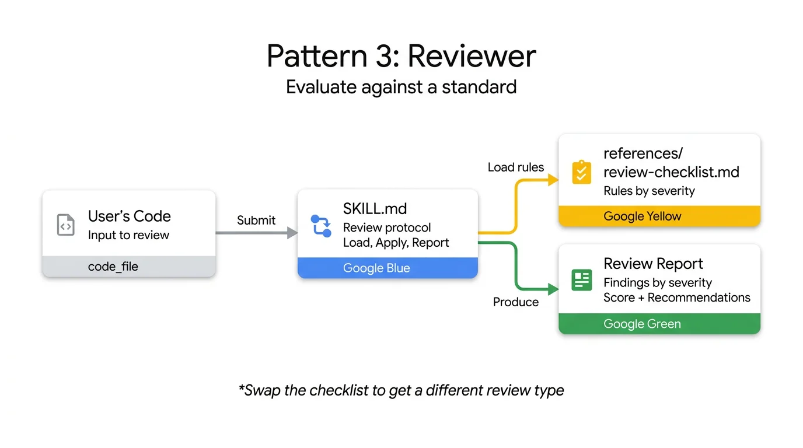
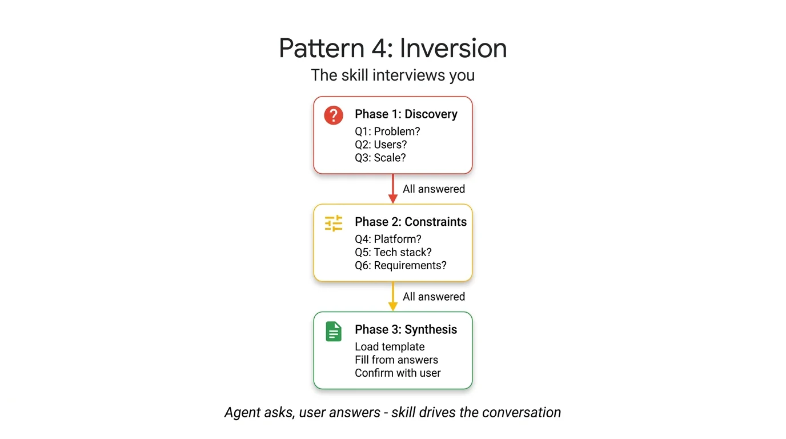
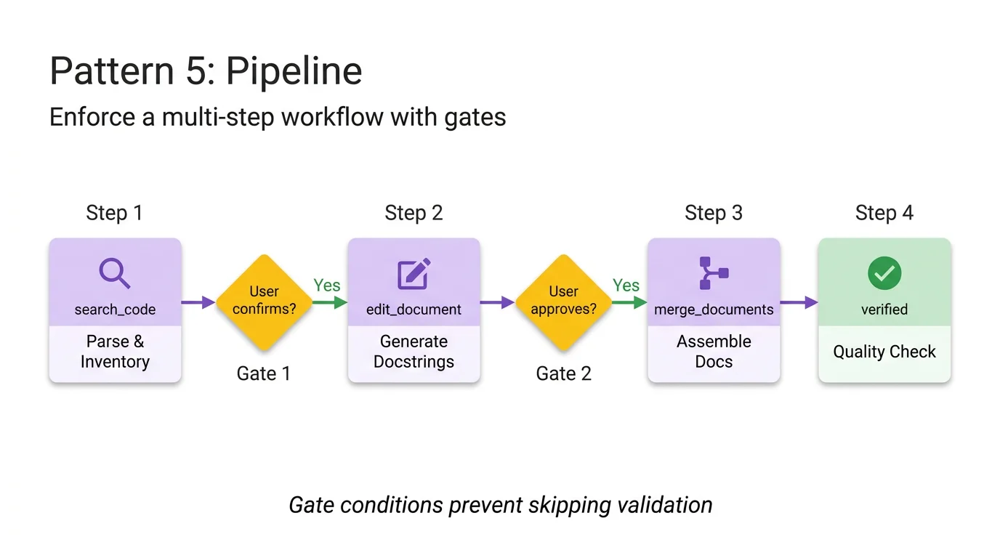
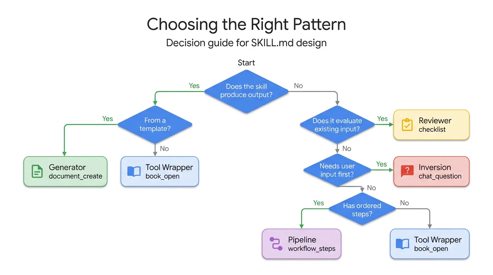

> **This post extends the 3-part ADK Skills series.**
> [Part 1: Progressive Disclosure with SkillToolset]()
> [Part 2: File-Based, External Skills, and SkillToolset Internals]()
> [Part 3: Skills That Write Skills — Self-Extending ADK Agents]()

In [Parts 1-3]() of this series, I covered the foundations — what agent skills are, how ADK's [SkillToolset](https://google.github.io/adk-docs/skills/) implements progressive disclosure, and how to build self-extending agents with meta-skills. But one question kept coming up in my own projects: I know how to create a skill, but how should I structure the content inside it?

A skill that wraps FastAPI conventions looks nothing like a skill that runs a 4-step documentation pipeline, yet both use the same SKILL.md format. The [Agent Skills specification](https://agentskills.io/specification) defines the container — SKILL.md frontmatter, `references/`, `assets/`, `scripts/` directories — but says nothing about what goes inside. That's a content design problem, not a format problem.

Five patterns keep surfacing. I've seen them across Claude Code's [bundled skills](https://github.com/anthropics/skills), community repos on [skills.sh](https://skills.sh/), real-world projects, and even in a [recent arXiv paper](https://arxiv.org/html/2602.20867v1) that formally catalogued seven system-level skill design patterns. This post names the five most practical ones, shows each in ADK with working code, and helps you pick the right one for your use case.

By the end of this post, you'll know how to:

  - Define **Tool Wrapper** skills that encode library best practices
  - Build **Generator** skills that produce structured output from templates
  - Create **Reviewer** skills that evaluate code against checklists
  - Design **Inversion** skills that interview the user before acting
  - Chain **Pipeline** skills that enforce multi-step workflows



> [!TIP] Key Takeaways
> - **Tool Wrapper** packages library conventions as on-demand knowledge — the simplest pattern, used by FastAPI's built-in SKILL.md
> - **Generator** produces structured output from templates in `assets/` with quality rules from `references/`
> - **Reviewer** evaluates code or content against a checklist, producing scored findings grouped by severity
> - **Inversion** flips the conversation — the skill interviews the user through phased questions before acting
> - **Pipeline** enforces sequential multi-step workflows with gate conditions between steps
> - Patterns compose: a Pipeline can embed a Reviewer step, a Generator can use Inversion for input gathering

## One SKILL.md Format, Many Use Cases

The [Agent Skills standard](https://agentskills.io/specification) has been adopted by over [30 agent tools](https://agentskills.io/home) — Claude Code, Gemini CLI, GitHub Copilot, Cursor, JetBrains Junie, and many more. The format is simple: a directory containing a `SKILL.md` file with YAML frontmatter and markdown instructions, plus optional `references/`, `assets/`, and `scripts/` subdirectories. I covered the format in detail in [Part 2](), so I won't repeat it here.

The format tells you how to package a skill. It doesn't tell you how to design the content. Should the instructions be a checklist? A workflow? A set of questions? Should references hold style guides, templates, or lookup tables? The answer depends on what your skill is trying to do, and that's where patterns come in.

Each of the five patterns in this post uses the same SKILL.md format but structures the content differently — different instruction styles, different resource types, different relationships between L2 (instructions) and L3 (references/assets). If you need a refresher on the three progressive disclosure levels, see [Part 1's explanation]().

## Quick Recap: SkillToolset and the Three Levels

ADK's [`SkillToolset`](https://google.github.io/adk-docs/skills/) implements progressive disclosure through three auto-generated tools. I covered the internals in [Part 2](), so here's just the quick version: `list_skills` shows skill names and descriptions (L1), `load_skill` fetches full instructions (L2), and [`load_skill_resource`](https://google.github.io/adk-docs/skills/#define-skills-with-files) loads reference files and templates on demand (L3). The agent pays ~100 tokens per skill at startup, then loads the rest only when needed.

For the pattern examples in this post, all five skills are loaded into a single `SkillToolset`. The agent decides which to activate based on the user's request.

```python
# agent.py
import pathlib

from google.adk import Agent
from google.adk.skills import load_skill_from_dir
from google.adk.tools.skill_toolset import SkillToolset

SKILLS_DIR = pathlib.Path(__file__).parent / "skills"

skill_toolset = SkillToolset(
    skills=[
        load_skill_from_dir(SKILLS_DIR / "api-expert"),       # Pattern 1: Tool Wrapper
        load_skill_from_dir(SKILLS_DIR / "report-generator"), # Pattern 2: Generator
        load_skill_from_dir(SKILLS_DIR / "code-reviewer"),    # Pattern 3: Reviewer
        load_skill_from_dir(SKILLS_DIR / "project-planner"),  # Pattern 4: Inversion
        load_skill_from_dir(SKILLS_DIR / "doc-pipeline"),     # Pattern 5: Pipeline
    ],
)

root_agent = Agent(
    model="gemini-2.5-flash",
    name="pattern_demo_agent",
    instruction="Load relevant skills before acting on any user request.",
    tools=[skill_toolset],
)
```

The description field in each skill's frontmatter is the most important line. It's the agent's search index — if the description is vague, the agent won't activate the skill when it should. Each pattern below shows how to write descriptions that trigger reliably.

## Pattern 1: Tool Wrapper — Teach the Agent a Library

A **Tool Wrapper** is an agent skill that packages a library or tool's conventions, best practices, and coding standards into on-demand knowledge the agent loads when working with that technology. It is the simplest SKILL.md pattern — instructions plus reference files, no templates or scripts.

A Tool Wrapper skill packages a library or tool's conventions into on-demand knowledge. The agent becomes a domain expert when the skill is loaded. Think FastAPI conventions, Terraform patterns, security policies, or database query best practices.

This is the simplest pattern. No templates, no scripts — just instructions telling the agent what rules to follow, plus `references/` holding the detailed convention docs.


*The Tool Wrapper pattern: SKILL.md triggers on library keywords, loads conventions from references/, and the agent applies them as domain expertise.*

```yaml
# skills/api-expert/SKILL.md
---
name: api-expert
description: FastAPI development best practices and conventions. Use when building, reviewing, or debugging FastAPI applications, REST APIs, or Pydantic models.
metadata:
  pattern: tool-wrapper
  domain: fastapi
---

You are an expert in FastAPI development. Apply these conventions to the user's code or question.

## Core Conventions

Load 'references/conventions.md' for the complete list of FastAPI best practices.

## When Reviewing Code
1. Load the conventions reference
2. Check the user's code against each convention
3. For each violation, cite the specific rule and suggest the fix

## When Writing Code
1. Load the conventions reference
2. Follow every convention exactly
3. Add type annotations to all function signatures
4. Use Annotated style for dependency injection
```

The `references/conventions.md` file holds the actual rules — naming conventions, route definitions, error handling patterns, async vs sync guidance. The agent loads this file only when it activates the skill, keeping the baseline context small.

The `description` here is critical. It includes specific keywords — "FastAPI", "REST APIs", "Pydantic models" — that match what developers actually type. A description like "Helps with APIs" would rarely trigger because it's too generic.

**When to use Tool Wrapper:** When the user works with a specific library or tool regularly and needs consistent expert guidance. FastAPI (0.115+) ships a SKILL.md directly in its pip package at `.agents/skills/fastapi/` — any skills-compatible agent scanning that path gets FastAPI expertise automatically. This is the pattern in production.

> [!NOTE]
> The `metadata` field in frontmatter is a `dict[str, str]` — ADK stores it but doesn't enforce any schema. I use it to tag skills by pattern and domain, which helps when you have 20+ skills and need to audit them.

## Pattern 2: Generator — Produce Structured Output

A **Generator** is an agent skill that produces documents, reports, or configurations by filling templates from `assets/` while following quality rules from `references/`. The instructions define the generation process; the template enforces structure; the style guide enforces quality.

A Generator skill produces documents, reports, or configurations from templates. The instructions define the generation process, `assets/` holds the output template, and `references/` holds the style guide. The agent fills in the template based on user input.

Generators use both L3 resource types: `assets/` for the template (the WHAT) and `references/` for the style guide (the HOW).


*The Generator pattern: instructions orchestrate the process, references/ defines quality rules, assets/ provides the output template.*

```yaml
# skills/report-generator/SKILL.md
---
name: report-generator
description: Generates structured technical reports in Markdown. Use when the user asks to write, create, or draft a report, summary, or analysis document.
metadata:
  pattern: generator
  output-format: markdown
---

You are a technical report generator. Follow these steps exactly:

Step 1: Load 'references/style-guide.md' for tone and formatting rules.

Step 2: Load 'assets/report-template.md' for the required output structure.

Step 3: Ask the user for any missing information needed to fill the template:
- Topic or subject
- Key findings or data points
- Target audience (technical, executive, general)

Step 4: Fill the template following the style guide rules. Every section in the template must be present in the output.

Step 5: Return the completed report as a single Markdown document.
```

The template in `assets/report-template.md` defines the exact sections every report must have — Executive Summary, Background, Methodology, Findings, Summary Table, Recommendations, Next Steps. The style guide in `references/style-guide.md` controls tone ("third person, active voice"), formatting ("H2 for sections, H3 for subsections"), and quality ("Executive Summary under 150 words, no vague Next Steps").

The agent loads both files via `load_skill_resource` when it activates the skill. The template enforces structure, the style guide enforces quality. Swap either file to change the output without touching the instructions.

**When to use Generator:** When consistency matters more than creativity. Reports, documentation, configuration files, commit messages — anywhere the output needs to follow a specific format every time.

## Pattern 3: Reviewer — Evaluate Against a Standard

A **Reviewer** is an agent skill that evaluates code, content, or artifacts against a defined checklist stored in `references/`, producing a scored report with findings grouped by severity. The skill separates WHAT to check (the checklist) from HOW to check (the review protocol).

A Reviewer skill evaluates code, content, or artifacts against a defined checklist. The instructions define the review protocol (load checklist, apply rules, produce structured findings), and the checklist lives in `references/`.

The key design choice: separating WHAT to check (the checklist) from HOW to check (the review protocol). This means you can swap `references/review-checklist.md` for `references/security-checklist.md` and get a completely different review from the same skill structure.


*The Reviewer pattern: user submits code, the skill loads its checklist from references/, applies the review protocol, and produces a findings report grouped by severity.*

```yaml
# skills/code-reviewer/SKILL.md
---
name: code-reviewer
description: Reviews Python code for quality, style, and common bugs. Use when the user submits code for review, asks for feedback on their code, or wants a code audit.
metadata:
  pattern: reviewer
  severity-levels: error,warning,info
---

You are a Python code reviewer. Follow this review protocol exactly:

Step 1: Load 'references/review-checklist.md' for the complete review criteria.

Step 2: Read the user's code carefully. Understand its purpose before critiquing.

Step 3: Apply each rule from the checklist to the code. For every violation found:
- Note the line number (or approximate location)
- Classify severity: error (must fix), warning (should fix), info (consider)
- Explain WHY it's a problem, not just WHAT is wrong
- Suggest a specific fix with corrected code

Step 4: Produce a structured review with these sections:
- **Summary**: What the code does, overall quality assessment
- **Findings**: Grouped by severity (errors first, then warnings, then info)
- **Score**: Rate 1-10 with brief justification
- **Top 3 Recommendations**: The most impactful improvements
```

The `references/review-checklist.md` contains the actual rules organized by category — Correctness (severity: error), Style (severity: warning), Documentation (severity: info), Security (severity: error), Performance (severity: info). Each category has specific, checkable items: "No mutable default arguments", "Functions under 30 lines", "No wildcard imports."

When I tested this against a function with three intentional bugs — `PascalCase` naming, a mutable default argument, and a bare `except:` — the agent loaded the skill, fetched the checklist, and caught all three. It classified the mutable default as an error (correct — it's a bug), the naming as a warning (correct — it's style), and produced a scored report. The checklist drove the behavior, not the agent's pre-training.

**When to use Reviewer:** Quality gates. Code review, security audit, compliance checks, editorial review. Anywhere a human reviewer works from a checklist, a Reviewer skill can encode it. [Giorgio Crivellari](https://medium.com/google-cloud/i-built-an-agent-skill-for-googles-adk-here-s-why-your-coding-agent-needs-one-too-e5d3a56ef81b) demonstrated this pattern with an ADK governance skill that improved code quality scores from 29% to 99%.

## Pattern 4: Inversion — The Skill Interviews You

**Inversion** is an agent skill pattern that flips the typical user-driven conversation — the skill instructs the agent to ask structured questions through defined phases before producing any output, preventing the agent from generating plans based on assumptions.

In most patterns, the user drives the conversation. Inversion flips this: the skill instructs the agent to ask structured questions before taking any action. The agent won't produce output until it has gathered all the information it needs.

No special framework support is required. Inversion is purely an instruction-authoring pattern — the instructions tell the agent to stop and wait for user input at specific points.


*The Inversion pattern: the skill drives the conversation through phased questions, only synthesizing output after all answers are gathered.*

```yaml
# skills/project-planner/SKILL.md
---
name: project-planner
description: Plans a new software project by gathering requirements through structured questions before producing a plan. Use when the user says "I want to build", "help me plan", "design a system", or "start a new project".
metadata:
  pattern: inversion
  interaction: multi-turn
---

You are conducting a structured requirements interview. DO NOT start building or designing until all phases are complete.

## Phase 1 — Problem Discovery (ask one question at a time, wait for each answer)

Ask these questions in order. Do not skip any.

- Q1: "What problem does this project solve for its users?"
- Q2: "Who are the primary users? What is their technical level?"
- Q3: "What is the expected scale? (users per day, data volume, request rate)"

## Phase 2 — Technical Constraints (only after Phase 1 is fully answered)

- Q4: "What deployment environment will you use?"
- Q5: "Do you have any technology stack requirements or preferences?"
- Q6: "What are the non-negotiable requirements? (latency, uptime, compliance, budget)"

## Phase 3 — Synthesis (only after all questions are answered)

1. Load 'assets/plan-template.md' for the output format
2. Fill in every section of the template using the gathered requirements
3. Present the completed plan to the user
4. Ask: "Does this plan accurately capture your requirements? What would you change?"
5. Iterate on feedback until the user confirms
```

The phased structure is what makes Inversion work. Phase 1 must complete before Phase 2 starts. Phase 3 only triggers after all questions are answered. The `DO NOT start building or designing until all phases are complete` instruction at the top is the critical gate — without it, agents tend to jump to conclusions after the first answer.

The `assets/plan-template.md` anchors the synthesis step. It defines sections for Problem Statement, Target Users, Scale Requirements, Technical Architecture, Non-Negotiable Requirements, Proposed Milestones, Risks & Mitigations, and Decision Log. The agent fills this template using the interview answers, producing a consistent output regardless of how the conversation went.

**When to use Inversion:** Requirements gathering, onboarding flows, diagnostic interviews, configuration wizards. Anywhere the agent needs context from the user before it can do useful work. The Inversion pattern prevents the most common agent failure mode — generating a detailed plan based on assumptions instead of asking.

## Pattern 5: Pipeline — Enforce a Multi-Step Workflow

A **Pipeline** is an agent skill that defines a sequential workflow where each step must complete before the next begins, with gate conditions that prevent the agent from skipping validation. It is the most complex pattern, combining all L3 resource types (`references/`, `assets/`, `scripts/`) with control flow.

A Pipeline skill defines a sequential workflow where each step must complete before the next begins. Steps can load different reference files, produce intermediate artifacts, and include gate conditions. The instructions ARE the workflow definition.

This is the most complex pattern — it combines all L3 resource types and adds control flow.


*The Pipeline pattern: steps execute sequentially with diamond gate conditions. "User confirms?" gates prevent the agent from skipping validation.*

```yaml
# skills/doc-pipeline/SKILL.md
---
name: doc-pipeline
description: Generates API documentation from Python source code through a multi-step pipeline. Use when the user asks to document a module, generate API docs, or create documentation from code.
metadata:
  pattern: pipeline
  steps: "4"
---

You are running a documentation generation pipeline. Execute each step in order. Do NOT skip steps or proceed if a step fails.

## Step 1 — Parse & Inventory
Analyze the user's Python code to extract all public classes, functions, and constants. Present the inventory as a checklist. Ask: "Is this the complete public API you want documented?"

## Step 2 — Generate Docstrings
For each function lacking a docstring:
- Load 'references/docstring-style.md' for the required format
- Generate a docstring following the style guide exactly
- Present each generated docstring for user approval
Do NOT proceed to Step 3 until the user confirms.

## Step 3 — Assemble Documentation
Load 'assets/api-doc-template.md' for the output structure. Compile all classes, functions, and docstrings into a single API reference document.

## Step 4 — Quality Check
Review against 'references/quality-checklist.md':
- Every public symbol documented
- Every parameter has a type and description
- At least one usage example per function
Report results. Fix issues before presenting the final document.
```

The gate conditions are the defining feature. "Do NOT proceed to Step 3 until the user confirms" prevents the agent from assembling documentation with unreviewed docstrings. "Do NOT skip steps or proceed if a step fails" at the top enforces the sequential constraint. Without these gates, agents tend to barrel through all steps and present a final result that skipped validation.

Each step loads different resources. Step 2 loads `references/docstring-style.md` (Google-style docstring format). Step 3 loads `assets/api-doc-template.md` (the output structure with Table of Contents, Classes, Functions, Constants sections). Step 4 loads `references/quality-checklist.md` (completeness and quality rules). The agent only pays context tokens for the resources it needs at each step.

**When to use Pipeline:** Any multi-step process with dependencies between steps. Data processing, document generation with validation, deployment workflows, migration procedures. If steps have a required order and you need gate conditions between them, use a Pipeline.

## Choosing the Right ADK Skill Pattern

Each pattern uses the SKILL.md format differently. This table summarizes the key differences:

| Pattern | Primary Use | L3 Resources | Complexity |
|---------|------------|--------------|------------|
| **Tool Wrapper** | Library/tool expertise | `references/` (conventions) | Low |
| **Generator** | Structured output | `assets/` (templates) + `references/` (style) | Medium |
| **Reviewer** | Quality evaluation | `references/` (checklists) | Medium |
| **Inversion** | Requirements gathering | `assets/` (output template) | Medium |
| **Pipeline** | Multi-step workflow | All three directories | High |

Patterns compose. A Pipeline can include a Reviewer step — the doc-pipeline's Step 4 loads `quality-checklist.md` and evaluates the assembled document against it, which is the Reviewer pattern embedded inside a Pipeline. A Generator can use Inversion to gather inputs before producing output. A Tool Wrapper can be embedded as a reference file inside a Pipeline skill. The [arXiv paper "SoK: Agentic Skills"](https://arxiv.org/html/2602.20867v1) (February 2026) found that production systems typically combine 2-3 patterns, with the most common combination being metadata-driven disclosure (our Tool Wrapper) plus marketplace distribution.

If you're unsure which pattern fits, start with this decision tree:


*Decision guide: follow the yes/no branches to find the right pattern for your use case. Most skills map clearly to one pattern.*

## The ADK Skills Ecosystem

You don't have to write every skill from scratch. The [Agent Skills standard](https://agentskills.io/specification) means skills authored for any compatible tool — Claude Code, Gemini CLI, Cursor, or any of the [30+ supported agents](https://agentskills.io/home) — use the same SKILL.md format and can be loaded in ADK with `load_skill_from_dir()`.

[skills.sh](https://skills.sh/) is the largest community marketplace, with over 86,000 total installs across skills from Vercel, Microsoft, Anthropic, Supabase, and independent developers. Top skills include `vercel-react-best-practices` (182K installs), `frontend-design` by Anthropic (130K installs), and `systematic-debugging` (24K installs). Install is a single command: `npx skills add <owner/repo>`.

Several curated collections on GitHub organize skills by category — [VoltAgent/awesome-agent-skills](https://github.com/VoltAgent/awesome-agent-skills) features official skills from leading development teams, and [kodustech/awesome-agent-skills](https://github.com/kodustech/awesome-agent-skills) includes architecture and design pattern skills. The [Anthropic skills repository](https://github.com/anthropics/skills) (86,500 stars) contains production-grade document skills for PowerPoint, Excel, Word, and PDF generation.

To load a community skill in ADK, clone or copy the skill directory and point `load_skill_from_dir` at it:

```python
# Loading a community skill from any skills-compatible source
community_skill = load_skill_from_dir(
    pathlib.Path(__file__).parent / "skills" / "community-skill-name"
)
```

The directory name must match the `name` field in the skill's SKILL.md frontmatter — ADK enforces this at load time ([Part 2]() covers the exact error behavior). Beyond that, any valid SKILL.md works.

## Frequently Asked Questions

**Can I use the same skill in Claude Code and ADK?**
Yes. Both use the [agentskills.io specification](https://agentskills.io/specification) — same SKILL.md format, same directory structure. A skill authored for Claude Code loads in ADK with `load_skill_from_dir()` and vice versa. The cross-client convention is to store shared skills in `<project>/.agents/skills/` or `~/.agents/skills/`.

**How many skills can one agent have?**
No hard limit in ADK v1.26.0. [`SkillToolset`](https://google.github.io/adk-docs/skills/) injects skill descriptions (~100 tokens each) on every LLM call via [`process_llm_request()`](https://github.com/google/adk-python/tree/main/src/google/adk/tools/skill_toolset.py). At 50 skills, that's roughly 5,000-7,500 tokens of overhead per call (including XML wrapping) — still manageable for models with 128K+ context windows. Performance degrades gracefully as skill count increases.

**Can patterns be combined?**
Yes. A Pipeline skill can include Reviewer steps (the doc-pipeline's Step 4 is a quality review). A Generator can use Inversion to gather inputs before producing output. The [arXiv paper](https://arxiv.org/html/2602.20867v1) found that production systems use a median of 2 patterns per skill, with the most common combination being metadata-driven disclosure plus marketplace distribution.

**What about `run_skill_script` for executable scripts?**
The `run_skill_script` tool exists in the [ADK source code](https://github.com/google/adk-python/tree/main/src/google/adk/tools/skill_toolset.py) but is not yet available in the pip release (v1.26.0). When it ships, it will enable Pipeline and Tool Wrapper patterns with executable Python and shell scripts in the `scripts/` directory. I previewed this capability in [Part 3's "What's Next"]().

**Where should I store skills — project level or user level?**
Project-level (`<project>/.agents/skills/`) for team-shared skills that live with the codebase. User-level (`~/.agents/skills/`) for personal skills across all projects. ADK uses explicit `load_skill_from_dir()` paths — you choose the directory, and the convention from the [Agent Skills spec](https://agentskills.io/specification) handles cross-client interoperability.

**How do I test a skill's effectiveness?**
The agentskills.io specification defines an [evaluation methodology](https://agentskills.io/skill-creation/evaluating-skills): create test cases in `evals/evals.json`, run each case with and without the skill, and measure the pass rate delta. The delta tells you exactly what the skill buys versus what it costs in context tokens.

## What's Next for ADK Skills

Clone the [companion repo](https://github.com/lavinigam-gcp/build-with-adk/tree/main/adk-skill-design-patterns), run [`adk web .`](https://google.github.io/adk-docs/runtime/web-interface/), and try each pattern. Start with the Reviewer — submit some Python code and watch the agent load the checklist and produce a scored review. Then swap `references/review-checklist.md` for your own team's coding standards.

If you're new to ADK Skills, start with [Part 1]() for foundations. If you want skills that create other skills, [Part 3]() covers the meta-skill pattern. This post is part of the [Agent Engineering series](/series/agent-engineering/) by [Lavi Nigam](/about/) — see [more on ADK](/tags/adk/) for related posts.

## References

1. [Skills for ADK Agents](https://google.github.io/adk-docs/skills/) — Official ADK documentation for SkillToolset and progressive disclosure
2. [Agent Skills Specification](https://agentskills.io/specification) — The open standard defining SKILL.md format, adopted by 30+ agent tools
3. [What Are Agent Skills?](https://agentskills.io/home) — Conceptual overview and adoption list from agentskills.io
4. [Part 1: Progressive Disclosure with SkillToolset]() — Foundations: L1/L2/L3 levels, inline skills
5. [Part 2: File-Based, External Skills, and SkillToolset Internals]() — SKILL.md format, load_skill_from_dir, multi-skill loading
6. [Part 3: Skills That Write Skills]() — Meta-skill pattern, self-extending agents
7. [Companion Code Repository](https://github.com/lavinigam-gcp/build-with-adk/tree/main/adk-agent-skills-tutorial) — Working code for Parts 1-3
8. [`skill_toolset.py`](https://github.com/google/adk-python/tree/main/src/google/adk/tools/skill_toolset.py) — SkillToolset source with auto-generated tools
9. [`skills_agent` sample](https://github.com/google/adk-python/tree/main/contributing/samples/skills_agent) — Official ADK sample with inline + file-based skills
10. [SoK: Agentic Skills — Beyond Tool Use in LLM Agents](https://arxiv.org/html/2602.20867v1) — arXiv paper (February 2026) identifying 7 system-level skill design patterns
11. [skills.sh — Agent Skills Directory](https://skills.sh/) — Community marketplace with 86,000+ total installs
12. [Anthropic Skills Repository](https://github.com/anthropics/skills) — 86,500 stars, production-grade document skills
13. [awesome-agent-skills (VoltAgent)](https://github.com/VoltAgent/awesome-agent-skills) — Curated collection from leading development teams
14. [awesome-agent-skills (kodustech)](https://github.com/kodustech/awesome-agent-skills) — Architecture and design pattern skills
15. [Using Scripts in Skills](https://agentskills.io/skill-creation/using-scripts) — Script design patterns for agentic use
16. [Evaluating Skills](https://agentskills.io/skill-creation/evaluating-skills) — Eval methodology: test cases, pass rate delta
17. [Giorgio Crivellari — I Built an Agent Skill for Google's ADK](https://medium.com/google-cloud/i-built-an-agent-skill-for-googles-adk-here-s-why-your-coding-agent-needs-one-too-e5d3a56ef81b) — Reviewer pattern achieving 29% to 99% code quality


